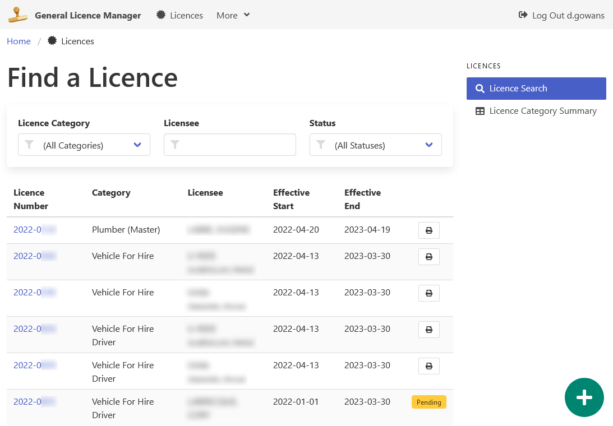

# General Licence Manager

An application built for the
[City of Sault Ste. Marie's Clerk's Department](https://saultstemarie.ca/City-Hall/City-Departments/Corporate-Services/City-Clerk/Licencing.aspx)
to manage the general licences issued by the municipality.

The application can handle several simple licence types,
but was built with the following licence types in mind.

-   Adult Parlour Owner/Operator
-   Amusement Arcade
-   Burlesque Attendant
-   Food Vending
-   Master Plumber
-   Pawnbroker
-   Peddler
-   Taxi, Limo and Shuttle Bus

**[User Documentation (In the Works)](docs/)**

## About this Project

⭐ **This application is under development and not ready for production use.** ⭐

Although the system is quite niche, it's being released in an open source environment
in hopes to pool developer resources from other municipalities
looking to move away from older, legacy systems.

It is being shared to start the dialog among other municipalities
and present an option to those who may be looking to refresh
their own licensing systems.

## Need a Solution Specific to Lottery Licences?

The City of Sault Ste. Marie has a related licensing application
written to handle the specific AGCO requirements of lottery licensing
in the province of Ontario.

[Check out the Lottery Licence Manager](https://github.com/cityssm/lottery-licence-manager)
