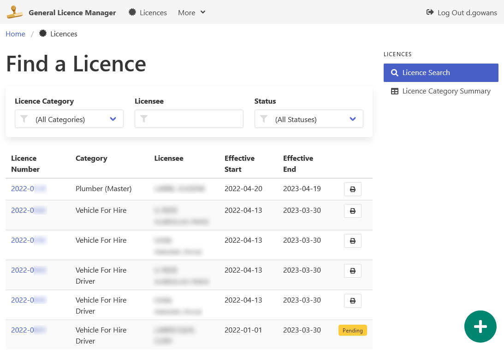

[Home](https://cityssm.github.io/general-licence-manager/)

# Help Documentation

**Thank you for taking the time to read the documentation.**

**[Tips and Tricks](tipsTricks.md)** 
Transform yourself from an average user into a power user. 🦸‍♀️

**[Lottery Licences](licences.md)** 
How do I search licence records? How do I maintain licences?

**[Licence Categories](categories.md)** 
What are licence categories?
How do I build them?

## Administrator Documentation

**[Getting Started](admin-gettingStarted.md)** 
How to setup and start the application for the first time.

**[config.js file](admin-configJS.md)** 
How to use the configuration file to customize the application.
