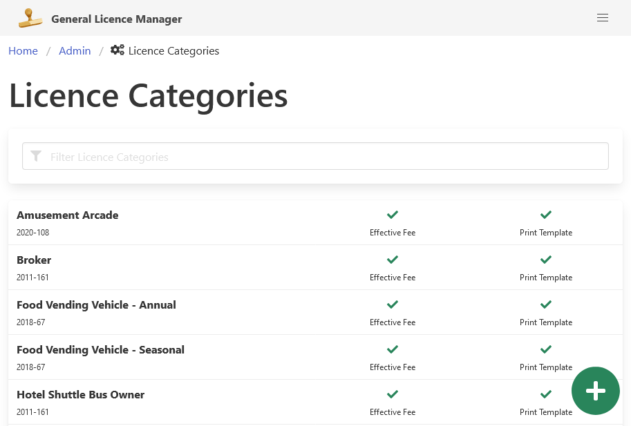

[Home](https://cityssm.github.io/general-licence-manager/)
•
[Help](https://cityssm.github.io/general-licence-manager/docs/)

# Licence Categories

The General Licence Manager application supports multiple types of licences
at the same time.
Licence categories are used to group together licences of the same type.

Each licence category can have the following unique features.

-   Duration calculated either using a number of years, months, and days,
    or using a custom function.

-   Custom licence print out.

-   Data fields for tracking licence specific details.

-   Mandatory and optional approvals.

-   Fees for new and renewed licences.

**Only application administrators can make changes to licence categories.**

## Creating a New Licence Category

To create a new Licence Category, click the green "Add New Category" button
in the bottom-right corner.

After entering a name for the new Licence Category,
the category will be created, and you will be redirected to the update window.

## Updating a Licence Category

To update an existing category, find it in the list of active categories,
and click on it.

The "Update Licence Category" window has four main sections.

-   Licence details
-   Additional fields
-   Approvals
-   Fees

### Update Main Licence Details

The main Licence Category details include:

-   Licence category name
-   By-law number
-   Licence print out template
-   Licence length function or duration

Print out templates can be built by a developer using the
[EJS templating language](https://ejs.co/).
Templates are stored in the "print" folder.
Two licence templates are included as examples.

Licence length functions can be used to calculate licence end dates
that are not a simple duration from the start date.  They can be written
by a developer using JavaScript, and added to the application's configuration file.

Click the green "Update Main Details" button to save any Licence Category changes.

### Maintain Additional Fields

Additional fields can be used to track licence specific information.
For example, a vehicle licence may need to track the make and model of the vehicle
being licensed.

Fields can be reordered by dragging and dropping them into their
preferred positions.

To add a new field, enter the new field name in the field,
and click the green "Add" button.

Fields consist of the following details.

-   **Field Name**.

-   **Field Description**, displayed under the field
    when editing a licence to assist with licence data entry.

-   **Required**, which prevents the licence from being created
    with the field being filled in.

-   **Minimum** and **Maximum Length**, to enforce a certain number
    of allowable characters in the field.

-   **Pattern**, which is a regular expression to validate input.

-   **Print Key**, which can be used in licence print out templates
    to retrieve and display a field value.

**When updating a licence field,
be sure to not change the meaning of the field.**
Doing so can result in confusing data on the licences
that make use of the field already.

### Maintain Approvals

Approvals help track whether the licensee has met the necessary
requirements to hold a licence in a checklist format.
For example, a food vendor licence may require preapproval
from the local health unit before it can be issued.

Approvals can be reordered by dragging and dropping them
into their preferred positions.

To add a new approval, enter the approval name in the field,
and click the green "Add" button.

Approvals consist of the following details.

-   **Approval Title**.

-   **Approval Description**, displayed under the approval checkbox
    when editing a licence to help clarify what the approval is.

-   **Required for New Licences** and **Required for Renewals**
    to prevent creating licence records without the appropriate approvals.

-   **Print Key**, which can be used in licence print out templates
    to retrieve the approval status.

**When updating a approval
be sure to not change the meaning of the approval.**
Doing so can result in confusing data on the licences
that make use of the approval already.

### Maintain Fees

Fees set the value of the licence.
Only one fee should be effective at the same time.

To add a new fee, click the green "Add Fee" button.

Fees consist of the following details.

-   **Effective Start Date** and **Effective End Date**,
    to indicate when the fee should be applied.
    The end date can be left blank to keep the fee from expiring.

-   **Licence Fee**, **Renewal Fee**, and **Replacement Fee**
    to set the cost of the licence.

## Removing a Licence Category

The option to delete licence categories can be found when viewing a category in the "More" menu.

Note that deleting a licence category will not delete any licences in the system
that make use of the category.  It will however prevent the category from being used
to issue future licences.
