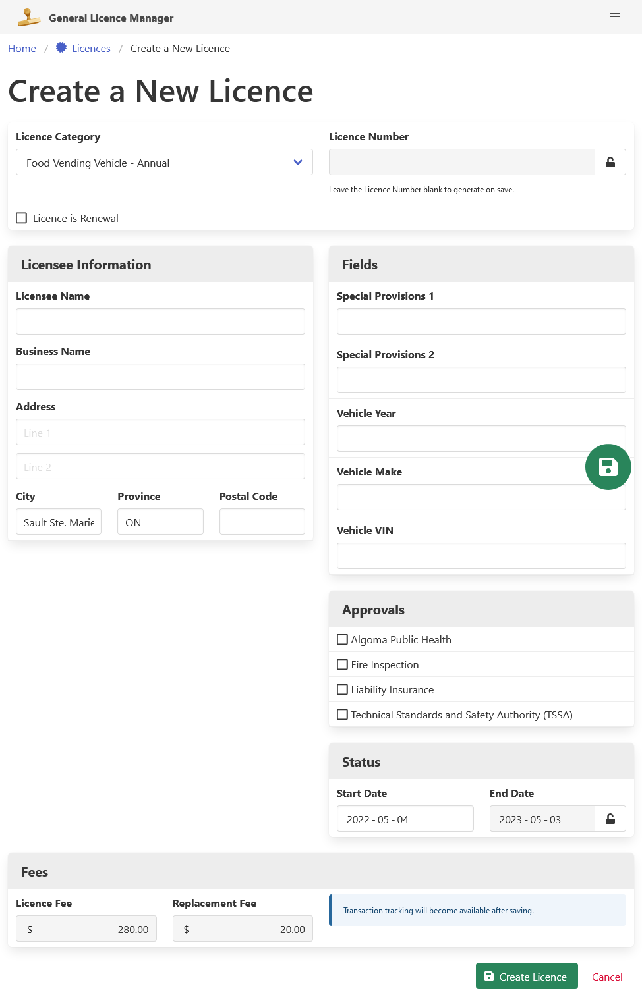
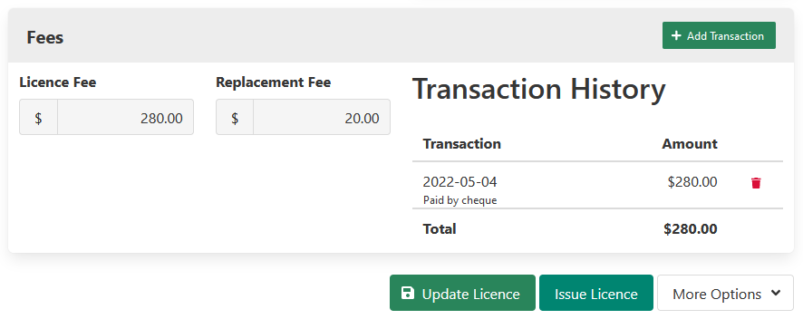

[Home](https://cityssm.github.io/general-licence-manager/)
•
[Help](https://cityssm.github.io/general-licence-manager/docs/)

# Licences

## Documentation Note

It is possible to configure the application to use different words
in place of "licence" and "licensee".
For example, the City of Sault Ste. Marie uses this application for two purposes.  In one installation, the defaults, "licence" and "licensee" are used,
while in another installation, "plan" and "ticket holder" are used.
For the purposes of documentation, the default terms will be used.

## Finding a Licence with the Licence Search

There are several filters to help with finding licences.

-   Licence Category.
-   Licensee Name or Business Name.
-   Licence Status (to hide past licences).

Search results are displayed below the filters in a table,
and include the following columns.

-   Licence Number.
-   Licence Category.
-   Licensee.
-   Effective Start and End Dates.
-   "Pending" Indicator or a Print Licence button.

## Create a New Licence

New licences can be created from the licence search,
from the main dashboard, or from an existing related licence.

Setting the Licence Category adjusts several aspects of the licence.

-   Enables licence specific fields and approvals.
-   Changes the licence end date calculation.
-   Sets the licence fee and replacement fee.

**Once the licence is created, the Licence Category cannot be changed.**

To save the new licence, click the green "Create Licence" button.

## View and Update a Licence

*Note that, although the update screens are described below,
the read only screens behave similarly.*

Once a licence record has been created, transactions can be added.
While the General Licence Manager application is not meant to be
a cash receipting system or a general ledger,
it does offer a way to calculate a licence fee and mark a licence fee as paid.

Before a licence can be printed, it must be issued.
To issue a licence, click the teal "Issue Licence" button,
found at the bottom of the page.
